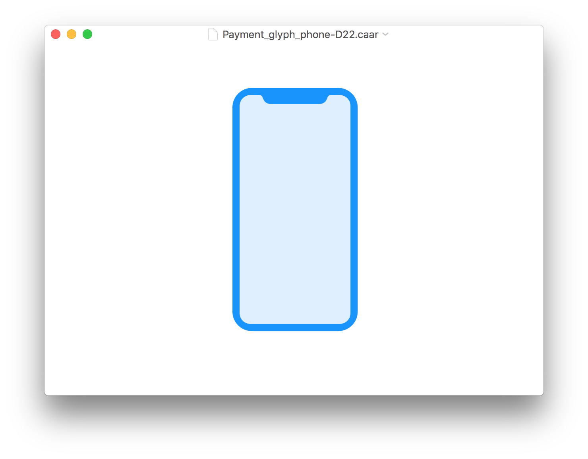
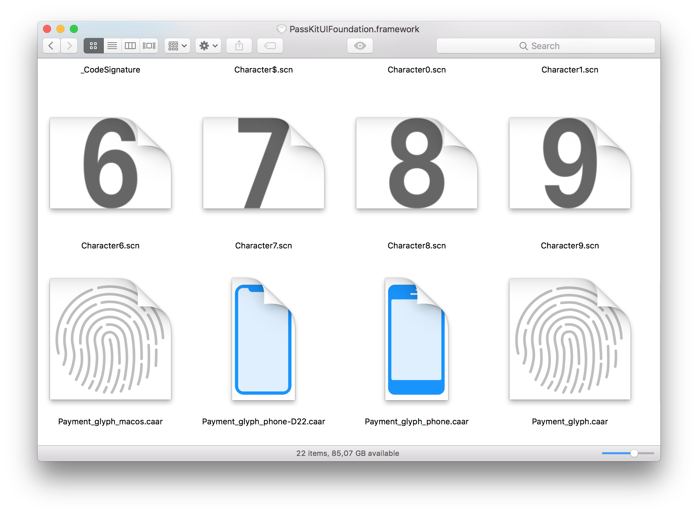

# Core Animation Archive Player

This app lets you view `.caar` and `.ca` files.

## What are .caar files?

CAAR files are Core Animation Archive files. They consist of core animation layers that are archived using `NSKeyedArchiver` to be later used as vector images in UI elements (especially when there are animations involved).

## What are .ca files?

Packages with the `.ca` extension are CAML (Core Animation Markup Language) bundles, they contain Core Animation trees encoded as XML and associated assets required by the encoded layer tree.

## Why do I care?

Core Animation files are used by Apple in several system frameworks and having a way to view them [can lead to some interesting discoveries](https://twitter.com/_inside/status/891841836754644992) 🙃

## QuickLook

The app also embeds a QuickLook plug-in that can generate thumbnails/previews of caar files.

---

### Hacky tool disclaimer 🤓

This is a very hacky and quick tool I made for myself. Some .caar files have proprietary classes encoded in them that can't be read by 3rd parties, if you have a caar file that can't be viewed with this app, that's probably the cause.